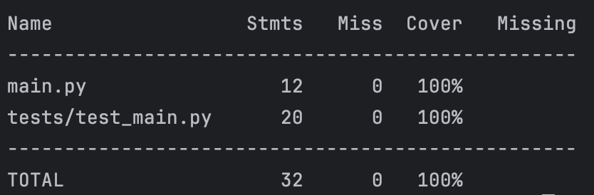

# Moscow Time Web Application


A Python web application built with **FastAPI** to display the current time in Moscow.

---

## **Features**
- Displays the current time in Moscow (UTC+3) in a visually appealing interface.
- Automatically updates the time on page refresh.
- Responsive design for seamless viewing on all devices.

---

## **Technologies Used**
- **FastAPI**: A modern, fast (high-performance) web framework for building APIs with Python.
- **Jinja2**: Templating engine for rendering HTML pages.
- **Uvicorn**: ASGI server for running FastAPI applications.

---

## **Installation**

1. Clone the repository:
   ```bash
   git clone https://github.com/secretanry/S25-core-course-labs.git
   cd app_python
2. Create a virtual environment:
   ```bash
   python -m venv venv
   source venv/bin/activate  # On Windows: venv\Scripts\activate
3. Install dependencies:
   ```bash
   pip install -r requirements.txt
4. Run the application:
   ```bash
   uvicorn main:app --reload
5. Open your browser and navigate to:
   ```text
   http://localhost:8000

## **Project Structure**
```
app_python/
├── main.py                # FastAPI application
├── requirements.txt       # Dependencies
├── templates/             # HTML templates
│   └── index.html
├── README.md              # Project documentation
├── PYTHON.md              # Best practices and coding standards
└── .gitignore             # Files to ignore in version control
```


## **Dependencies**
1. fastapi
2. uvicorn
3. jinja2
4. pytz

## Docker

### Overview

Our application is containerized using Docker to ensure consistent environments across development, testing, and production stages. Below are instructions on how to build, pull, and run the containerized application.

### How to Build?

To build the Docker image locally, follow these steps:

1. Navigate to the `app_python` directory.
2. Ensure you have Docker installed and running on your machine.
3. Run the following command to build the Docker image:

   ```sh
   docker build -t python_app .
   ```
### How to Pull?

If the Docker image has been pushed to a registry (e.g., Docker Hub), you can pull it directly without building:

1. Ensure Docker is installed and running.
2. Run the following command to pull the image:
   ```shell
   docker pull secretanry/python_app:latest
   ```

### How to Run?
1. After building or pulling the image, you can run the container using the following command:
   ```shell
   docker run -p 8000:8000 python_app
   ```

## Unit Tests

To run the unit tests for this application, follow these steps:

1. **Install Dependencies**:
   Make sure you have `pytest` and `coverage` installed. If not, install it using:
   ```bash
   pip install pytest
   pip install coverage
   ```
2. **Run the tests with coverage report**:
   ```bash
   coverage run -m pytest
   coverage report -m
   ```
3. **Inspect the output**:
   Firstly, you will see tests report about tests status, then coverage report. It will look like:
   

## CI/CD Workflow

This project uses GitHub Actions for continuous integration and continuous deployment. The CI workflow runs on **every branch** and includes the following steps:

- **Dependencies:** Installs project dependencies using pip.
- **Linter:** Runs `flake8` to check code style and catch potential issues.
- **Tests:** Executes unit tests using `pytest` and `coverage` to ensure code quality.
- **Docker:** 
  - **Login:** Authenticates to DockerHub.
  - **Build:** Builds a Docker image for the application.
  - **Push:** Pushes the Docker image to DockerHub.


## **License**
This project is licensed under the **MIT License**.
