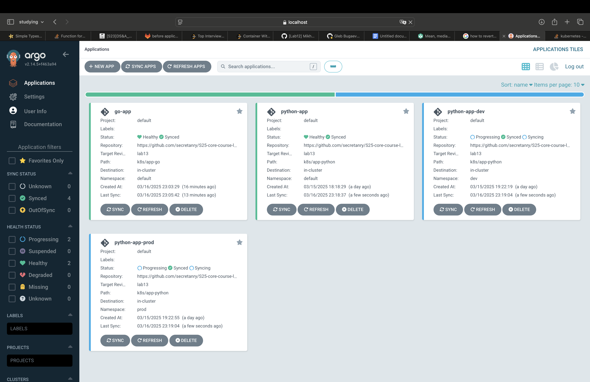

# Task 2

1) Before pod deletion
   ```bash
     kubectl get pods -n prod
   ```
   ```
   NAME                         READY   STATUS    RESTARTS   AGE
   app-python-fcf9bd86c-66hq6   1/1     Running   0          3m54s
   app-python-fcf9bd86c-r5hrf   1/1     Running   0          3m59s
   app-python-fcf9bd86c-z6p8v   1/1     Running   0          4m2s
   ```
2) After pod deletion
   ```
   NAME                         READY   STATUS    RESTARTS   AGE
   app-python-fcf9bd86c-hjx9q   1/1     Running   0          13s
   app-python-fcf9bd86c-l6pfm   1/1     Running   0          13s
   app-python-fcf9bd86c-xlv5v   1/1     Running   0          13s
   ```
   
3) UI Screenshot


4) Argo CD continuously monitors the Kubernetes cluster and compares it with the desired state defined in Git. If any configuration drift occurs—such as manual changes to deployments or services—it marks the application as OutOfSync and can optionally auto-sync to revert the changes. Runtime events like pod crashes, restarts, or PVC bindings are not treated as drifts unless they modify the declarative configuration. However, if runtime systems like an HPA change replica counts, Argo CD may see this as drift and revert it, unless configured to ignore such fields.