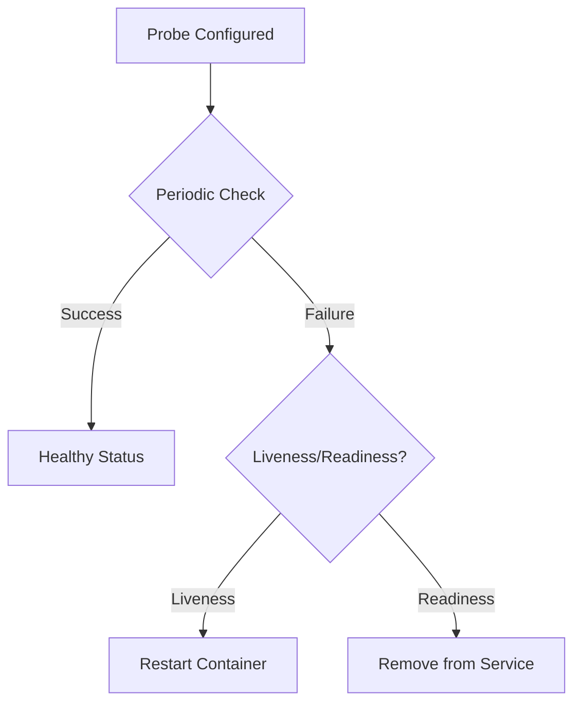
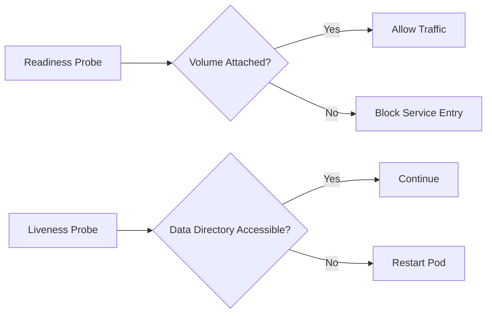

# Task 2

1) Stateful set status
```bash
  kubectl get po -n stateful
```

```
NAME           READY   STATUS    RESTARTS   AGE
app-python-0   1/1     Running   0          2m35s
app-python-1   1/1     Running   0          2m34s
app-python-2   1/1     Running   0          2m33s
```

```bash
  kubectl get sts -n stateful
```

```
NAME         READY   AGE
app-python   3/3     3m14s
```

```bash
  kubectl get svc -n stateful
```

```
NAME         TYPE        CLUSTER-IP       EXTERNAL-IP   PORT(S)    AGE
app-python   ClusterIP   10.105.237.145   <none>        8080/TCP   3m44s
```

```bash
  kubectl get pvc -n stateful
```

```
NAME                         STATUS   VOLUME                                     CAPACITY   ACCESS MODES   STORAGECLASS   VOLUMEATTRIBUTESCLASS   AGE
config-volume-app-python-0   Bound    pvc-b73c0c2c-8cc4-493a-af02-c945c40b74ae   1Gi        RWO            standard       <unset>                 34m
config-volume-app-python-1   Bound    pvc-02dae71d-2618-4e01-9dae-57c354db6faa   1Gi        RWO            standard       <unset>                 21m
config-volume-app-python-2   Bound    pvc-cbf09b0b-0cf9-40a3-b110-d5ce640f813c   1Gi        RWO            standard       <unset>                 21m
```

2) Persistent storage validation
```bash
  kubectl delete pod -n stateful app-python-0
```

```
pod "app-python-0" deleted
```

```bash
  kubectl get pvc -n stateful
```

```
NAME                         STATUS   VOLUME                                     CAPACITY   ACCESS MODES   STORAGECLASS   VOLUMEATTRIBUTESCLASS   AGE
config-volume-app-python-0   Bound    pvc-b73c0c2c-8cc4-493a-af02-c945c40b74ae   1Gi        RWO            standard       <unset>                 41m
config-volume-app-python-1   Bound    pvc-02dae71d-2618-4e01-9dae-57c354db6faa   1Gi        RWO            standard       <unset>                 28m
config-volume-app-python-2   Bound    pvc-cbf09b0b-0cf9-40a3-b110-d5ce640f813c   1Gi        RWO            standard       <unset>                 28m
```

3) Headless Service Access

```bash
  kubectl exec -n stateful app-python-0 -- nslookup app-python-1.app-python.default.svc.cluster.local
```

```
Server:		10.96.0.10
Address:	10.96.0.10:53


Name:	app-python-1.app-python.default.svc.cluster.local
Address: 10.244.0.201
```

4) Monitoring and alerts
## How Kubernetes Probes Ensure Pod Health

### Core Mechanisms
1. **Continuous Health Monitoring**
    - Regularly check container status through defined endpoints or commands
    - Operate at the node level via kubelet (no API server dependency)

2. **Failure Detection & Response**
    - Identify hung processes/crashes
    - Trigger automatic remediation actions
    - Prevent silent failures from propagating

---

### Liveness Probe Protection
- **Function**:  
  Determines if container needs restarting
- **Health Preservation**:
    - Restarts containers stuck in broken states
    - Clears resource leaks/memory issues
    - Breaks infinite loop scenarios

---

### Readiness Probe Safeguards
- **Function**:  
  Controls when containers receive traffic
- **Health Preservation**:
    - Prevents premature traffic exposure
    - Enables graceful scaling/updates
    - Isolates temporarily overloaded instances

---

### Health Assurance Workflow


## Why Probes Are Critical for Stateful Applications

### Core Imperatives
1. **Data Integrity Enforcement**
    - Prevent concurrent writes to shared persistent volumes
    - Block operations during storage subsystem failures
    - Ensure ACID compliance in database operations

2. **Stateful Workflow Guarantees**
    - Enforce strict pod initialization order (Pod 0 → 1 → 2)
    - Maintain quorum requirements for clustered systems
    - Coordinate leader election processes

---

### Stateful System Protection
**Persistent Storage Safety**


5) Ordering Guarantee and Parallel Operations
## Explain why ordering guarantees are unnecessary for your app
Because my app only displays the current time and there isnt any connection between users' requests
## Implement a way to instruct the StatefulSet controller to launch or terminate all Pods in parallel
Example
```yaml
apiVersion: apps/v1
kind: StatefulSet
metadata:
  name: parallel-app
spec:
  podManagementPolicy: Parallel
  serviceName: parallel-svc
  updateStrategy:
    type: RollingUpdate
    rollingUpdate:
      partition: 0
      maxUnavailable: 100%

  replicas: 3
  template:
    spec:
      containers:
      - name: main
        image: your-image:latest
```