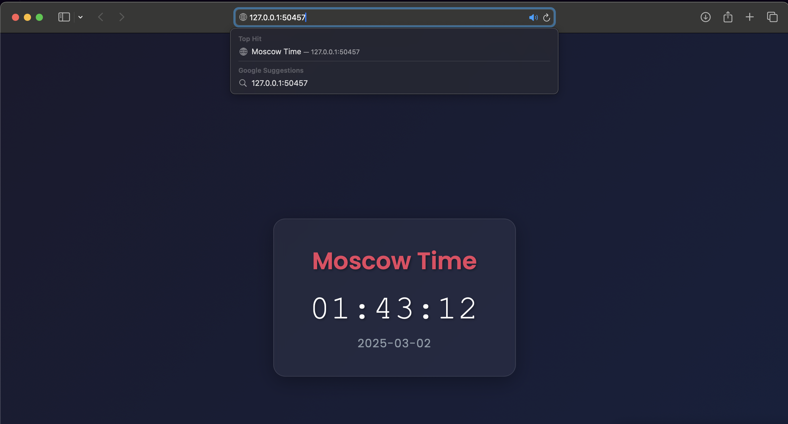

# Deployment without manifests

1. Deploy application on particular port
```bash
  kubectl create deployment app-python --image=secretanry/python_app:latest --port=8000
```
2. Create service to access application
```bash
  kubectl expose deployment app-python --type=NodePort --port=8000 
```
Now we can access our application two ways:
Using **minikube tunnel** 
```bash
  minikube service app-python
```
```
  |-----------|------------|-------------|---------------------------|
  | NAMESPACE |    NAME    | TARGET PORT |            URL            |
  |-----------|------------|-------------|---------------------------|
  | default   | app-python |        8000 | http://192.168.49.2:31098 |
  |-----------|------------|-------------|---------------------------|
  🏃  Starting tunnel for service app-python.
  |-----------|------------|-------------|------------------------|
  | NAMESPACE |    NAME    | TARGET PORT |          URL           |
  |-----------|------------|-------------|------------------------|
  | default   | app-python |             | http://127.0.0.1:49974 |
  |-----------|------------|-------------|------------------------|
  🎉  Opening service default/app-python in default browser...
  ❗  Because you are using a Docker driver on darwin, the terminal needs to be open to run it.
```
Using **port forwarding**
```bash
   kubectl port-forward deployment/app-python 8000:8000
```
```
  Forwarding from 127.0.0.1:8000 -> 8000
  Forwarding from [::1]:8000 -> 8000
  Handling connection for 8000
```
3. Get pod status
```bash
  kubectl get pods
```
```
  NAME                         READY   STATUS    RESTARTS   AGE
  app-python-6645f64f9-4kgzq   1/1     Running   0          20m
```

```bash
  kubectl get svc
```
```
  NAME         TYPE        CLUSTER-IP   EXTERNAL-IP   PORT(S)          AGE
  app-python   NodePort    10.105.9.4   <none>        8000:31098/TCP   19m
  kubernetes   ClusterIP   10.96.0.1    <none>        443/TCP          29m
```

4. Delete deployment
```bash
  kubectl delete deployment app-python
```
```
  deployment.apps "app-python" deleted
```

```bash
  kubectl delete service app-python
```
```
  service "app-python" deleted
```

# Deployment using manifests

1. Create deployment manifest **deployment.yml**
```yaml
  apiVersion: apps/v1
  kind: Deployment
  metadata:
    name: app-python
  spec:
    replicas: 3
    selector:
      matchLabels:
        app: app-python
    template:
      metadata:
        labels:
          app: app-python
      spec:
        containers:
          - name: app-python-container
            image: secretanry/python_app:latest
            ports:
              - containerPort: 8000
```

Apply the manifest
```bash
  kubectl apply -f deployment.yml
```

2. Create service manifest **service.yml**
```yaml
  apiVersion: v1
  kind: Service
  metadata:
    name: app-python-service
  spec:
    type: NodePort
    selector:
      app: app-python
    ports:
      - protocol: TCP
        port: 8000
        targetPort: 8000
        nodePort: 30007
```

3. Get pods status
```bash
  kubectl get pods
```
```
  NAME                          READY   STATUS    RESTARTS   AGE
  app-python-7fb797f598-2g7hb   1/1     Running   0          22s
  app-python-7fb797f598-5dktb   1/1     Running   0          22s
  app-python-7fb797f598-zlfkv   1/1     Running   0          22s
```

4. Get service status
```bash
  kubectl get svc
```
```
  NAME                 TYPE        CLUSTER-IP     EXTERNAL-IP   PORT(S)          AGE
  app-python-service   NodePort    10.97.62.170   <none>        8000:30007/TCP   4m58s
  kubernetes           ClusterIP   10.96.0.1      <none>        443/TCP          44m
```

5. Start minikube tunnel for all services
```bash
  minikube service --all
```
```
|-----------|--------------------|-------------|---------------------------|
| NAMESPACE |        NAME        | TARGET PORT |            URL            |
|-----------|--------------------|-------------|---------------------------|
| default   | app-python-service |        8000 | http://192.168.49.2:30007 |
|-----------|--------------------|-------------|---------------------------|
|-----------|------------|-------------|--------------|
| NAMESPACE |    NAME    | TARGET PORT |     URL      |
|-----------|------------|-------------|--------------|
| default   | kubernetes |             | No node port |
|-----------|------------|-------------|--------------|
😿  service default/kubernetes has no node port
❗  Services [default/kubernetes] have type "ClusterIP" not meant to be exposed, however for local development minikube allows you to access this !
🏃  Starting tunnel for service app-python-service.
🏃  Starting tunnel for service kubernetes.
|-----------|--------------------|-------------|------------------------|
| NAMESPACE |        NAME        | TARGET PORT |          URL           |
|-----------|--------------------|-------------|------------------------|
| default   | app-python-service |             | http://127.0.0.1:50457 |
| default   | kubernetes         |             | http://127.0.0.1:50458 |
|-----------|--------------------|-------------|------------------------|
🎉  Opening service default/app-python-service in default browser...
🎉  Opening service default/kubernetes in default browser...
❗  Because you are using a Docker driver on darwin, the terminal needs to be open to run it.

```


# Bonus

1. Deployment **go_deployment.yml**
```yaml
  apiVersion: apps/v1
  kind: Deployment
  metadata:
    name: app-go
  spec:
    replicas: 3
    selector:
      matchLabels:
        app: app-go
    template:
      metadata:
        labels:
          app: app-go
      spec:
        containers:
          - name: app-go-container
            image: secretanry/app_go:latest
            ports:
              - containerPort: 8080
```
2. Service **go_service.yml**
```yaml
  apiVersion: v1
  kind: Service
  metadata:
    name: app-go-service
  spec:
    type: NodePort
    selector:
      app: app-go
    ports:
      - protocol: TCP
        port: 8080
        targetPort: 8080
        nodePort: 30008
```
3. Check deployment
```bash
  minikube service --all
```
```
|-----------|----------------|-------------|---------------------------|
| NAMESPACE |      NAME      | TARGET PORT |            URL            |
|-----------|----------------|-------------|---------------------------|
| default   | app-go-service |        8080 | http://192.168.49.2:30008 |
|-----------|----------------|-------------|---------------------------|
|-----------|--------------------|-------------|---------------------------|
| NAMESPACE |        NAME        | TARGET PORT |            URL            |
|-----------|--------------------|-------------|---------------------------|
| default   | app-python-service |        8000 | http://192.168.49.2:30007 |
|-----------|--------------------|-------------|---------------------------|
|-----------|------------|-------------|--------------|
| NAMESPACE |    NAME    | TARGET PORT |     URL      |
|-----------|------------|-------------|--------------|
| default   | kubernetes |             | No node port |
|-----------|------------|-------------|--------------|
😿  service default/kubernetes has no node port
❗  Services [default/kubernetes] have type "ClusterIP" not meant to be exposed, however for local development minikube allows you to access this !
🏃  Starting tunnel for service app-go-service.
🏃  Starting tunnel for service app-python-service.
🏃  Starting tunnel for service kubernetes.
|-----------|--------------------|-------------|------------------------|
| NAMESPACE |        NAME        | TARGET PORT |          URL           |
|-----------|--------------------|-------------|------------------------|
| default   | app-go-service     |             | http://127.0.0.1:50671 |
| default   | app-python-service |             | http://127.0.0.1:50673 |
| default   | kubernetes         |             | http://127.0.0.1:50675 |
|-----------|--------------------|-------------|------------------------|
🎉  Opening service default/app-go-service in default browser...
🎉  Opening service default/app-python-service in default browser...
🎉  Opening service default/kubernetes in default browser...
❗  Because you are using a Docker driver on darwin, the terminal needs to be open to run it.
```

4. Add ingress to minikube
```bash
  minikube addons enable ingress
```
```
💡  ingress is an addon maintained by Kubernetes. For any concerns contact minikube on GitHub.
You can view the list of minikube maintainers at: https://github.com/kubernetes/minikube/blob/master/OWNERS
💡  After the addon is enabled, please run "minikube tunnel" and your ingress resources would be available at "127.0.0.1"
    ▪ Using image registry.k8s.io/ingress-nginx/controller:v1.11.3
    ▪ Using image registry.k8s.io/ingress-nginx/kube-webhook-certgen:v1.4.4
    ▪ Using image registry.k8s.io/ingress-nginx/kube-webhook-certgen:v1.4.4
🔎  Verifying ingress addon...
🌟  The 'ingress' addon is enabled
```

5. Adding **ingress.yml**
```yaml
  apiVersion: networking.k8s.io/v1
  kind: Ingress
  metadata:
    name: my-apps-ingress
    annotations:
      nginx.ingress.kubernetes.io/rewrite-target: /
  spec:
    rules:
      - host: app-python.local
        http:
          paths:
            - path: /
              pathType: Prefix
              backend:
                service:
                  name: app-python-service
                  port:
                    number: 8000
      - host: app-go.local
        http:
          paths:
            - path: /
              pathType: Prefix
              backend:
                service:
                  name: app-go-service
                  port:
                    number: 8080
```

6. Applying ingress manifest
```bash
  kubectl apply -f ingress.yml
```

7. Checking ingress configuration
```bash
  kubectl get ingress
```
```
  NAME              CLASS   HOSTS                           ADDRESS        PORTS   AGE
  my-apps-ingress   nginx   app-python.local,app-go.local   192.168.49.2   80      54s
```

8. Accessing ingress network
Since I am using MacOS firstly I need to start a tunnel to minikube
```bash
  minikube tunnel
```
```
✅  Tunnel successfully started

📌  NOTE: Please do not close this terminal as this process must stay alive for the tunnel to be accessible ...

❗  The service/ingress my-apps-ingress requires privileged ports to be exposed: [80 443]
🔑  sudo permission will be asked for it.
🏃  Starting tunnel for service my-apps-ingress.
```

```bash
  curl --resolve "app-python.local:80:127.0.0.1" -i http://app-python.local
```
```
HTTP/1.1 200 OK
Date: Sat, 01 Mar 2025 23:05:20 GMT
Content-Type: text/html; charset=utf-8
Content-Length: 3571
Connection: keep-alive

<!DOCTYPE html>
<html lang="en">
<head>
    <meta charset="UTF-8">
    <meta name="viewport" content="width=device-width, initial-scale=1.0">
    <title>Moscow Time</title>
    <link href="https://fonts.googleapis.com/css2?family=Poppins:wght@300;400;600&display=swap" rel="stylesheet">
    <style>
        * {
            margin: 0;
            padding: 0;
            box-sizing: border-box;
        }

        body {
            display: flex;
            justify-content: center;
            align-items: center;
            min-height: 100vh;
            background: linear-gradient(135deg, #1a1a2e, #16213e);
            font-family: 'Poppins', sans-serif;
            animation: gradientShift 15s ease infinite;
        }

        .container {
            position: relative;
            background: rgba(255, 255, 255, 0.05);
            backdrop-filter: blur(10px);
            border-radius: 20px;
            padding: 40px 60px;
            box-shadow: 0 8px 32px rgba(0, 0, 0, 0.3);
            border: 1px solid rgba(255, 255, 255, 0.1);
            transform-style: preserve-3d;
            transition: transform 0.3s ease;
            overflow: hidden;
        }

        .container::before {
            content: '';
            position: absolute;
            top: 0;
            left: -100%;
            width: 100%;
            height: 100%;
            background: linear-gradient(
                90deg,
                transparent,
                rgba(255, 255, 255, 0.2),
                transparent
            );
            transition: 0.5s;
        }

        .container:hover::before {
            left: 100%;
        }

        .time-box {
            text-align: center;
            position: relative;
            z-index: 1;
        }

        h1 {
            color: #e94560;
            font-weight: 600;
            margin-bottom: 20px;
            font-size: 2.5em;
            text-shadow: 2px 2px 4px rgba(0, 0, 0, 0.3);
        }

        .time {
            font-size: 3.5em;
            color: #fff;
            font-weight: 300;
            letter-spacing: 2px;
            text-shadow: 2px 2px 4px rgba(0, 0, 0, 0.3);
            margin-bottom: 10px;
            font-family: 'Courier New', monospace;
        }

        .date {
            color: #8f9ba8;
            font-size: 1.2em;
            letter-spacing: 1px;
        }

        .particles {
            position: fixed;
            width: 100%;
            height: 100%;
            pointer-events: none;
            z-index: 0;
        }

        @keyframes gradientShift {
            0% { background-position: 0% 50%; }
            50% { background-position: 100% 50%; }
            100% { background-position: 0% 50%; }
        }

        @media (max-width: 768px) {
            .container {
                padding: 30px;
                margin: 20px;
            }

            h1 {
                font-size: 2em;
            }

            .time {
                font-size: 2.5em;
            }
        }

        @keyframes float {
            0% { transform: translateY(0px); }
            50% { transform: translateY(-10px); }
            100% { transform: translateY(0px); }
        }

        .time {
            animation: float 3s ease-in-out infinite;
        }
    </style>
</head>
<body>
    <div class="particles"></div>
    <div class="container">
        <div class="time-box">
            <h1>Moscow Time</h1>
            <div class="time">02:05:20</div>
            <div class="date">2025-03-02</div>
        </div>
    </div>
</body>
</html>
```

```bash
  curl --resolve "app-go.local:80:127.0.0.1" -i http://app-go.local
```
```
HTTP/1.1 200 OK
Date: Sat, 01 Mar 2025 23:09:23 GMT
Content-Type: text/html; charset=utf-8
Transfer-Encoding: chunked
Connection: keep-alive

<!DOCTYPE html>
<html lang="en">
<head>
    <meta charset="UTF-8">
    <meta name="viewport" content="width=device-width, initial-scale=1.0">
    <title>Fork Counter</title>
    <link href="https://fonts.googleapis.com/css2?family=Poppins:wght@300;400;600&display=swap" rel="stylesheet">
    <style>
        * {
            margin: 0;
            padding: 0;
            box-sizing: border-box;
        }

        body {
            display: flex;
            justify-content: center;
            align-items: center;
            min-height: 100vh;
            background: linear-gradient(135deg, #1a1a2e, #16213e);
            font-family: 'Poppins', sans-serif;
            animation: gradientShift 15s ease infinite;
        }

        .container {
            position: relative;
            background: rgba(255, 255, 255, 0.05);
            backdrop-filter: blur(10px);
            border-radius: 20px;
            padding: 40px 60px;
            box-shadow: 0 8px 32px rgba(0, 0, 0, 0.3);
            border: 1px solid rgba(255, 255, 255, 0.1);
            transform-style: preserve-3d;
            transition: transform 0.3s ease;
            overflow: hidden;
        }

        .container::before {
            content: '';
            position: absolute;
            top: 0;
            left: -100%;
            width: 100%;
            height: 100%;
            background: linear-gradient(
                90deg,
                transparent,
                rgba(255, 255, 255, 0.2),
                transparent
            );
            transition: 0.5s;
        }

        .container:hover::before {
            left: 100%;
        }

        .time-box {
            text-align: center;
            position: relative;
            z-index: 1;
        }

        h1 {
            color: #e94560;
            font-weight: 600;
            margin-bottom: 20px;
            font-size: 2.5em;
            text-shadow: 2px 2px 4px rgba(0, 0, 0, 0.3);
        }

        .time {
            font-size: 3.5em;
            color: #fff;
            font-weight: 300;
            letter-spacing: 2px;
            text-shadow: 2px 2px 4px rgba(0, 0, 0, 0.3);
            margin-bottom: 10px;
            font-family: 'Courier New', monospace;
        }

        .date {
            color: #8f9ba8;
            font-size: 1.2em;
            letter-spacing: 1px;
        }

        .particles {
            position: fixed;
            width: 100%;
            height: 100%;
            pointer-events: none;
            z-index: 0;
        }

        @keyframes gradientShift {
            0% { background-position: 0% 50%; }
            50% { background-position: 100% 50%; }
            100% { background-position: 0% 50%; }
        }

        @media (max-width: 768px) {
            .container {
                padding: 30px;
                margin: 20px;
            }

            h1 {
                font-size: 2em;
            }

            .time {
                font-size: 2.5em;
            }
        }

        @keyframes float {
            0% { transform: translateY(0px); }
            50% { transform: translateY(-10px); }
            100% { transform: translateY(0px); }
        }

        .time {
            animation: float 3s ease-in-out infinite;
        }
    </style>
</head>
<body>
    <div class="particles"></div>
    <div class="container">
        <div class="time-box">
            <h1>Amount of forks in course repo</h1>
            <div class="time">143</div>
        </div>
    </div>
</body>
</html>
```