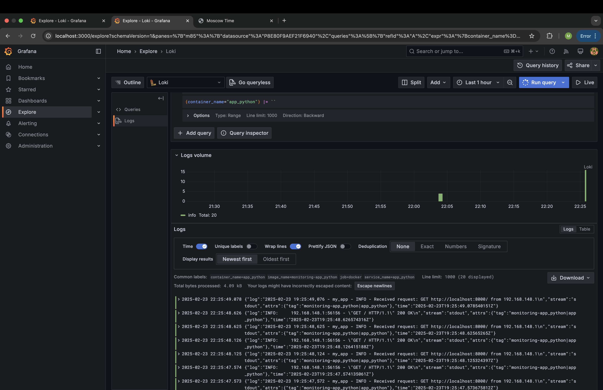
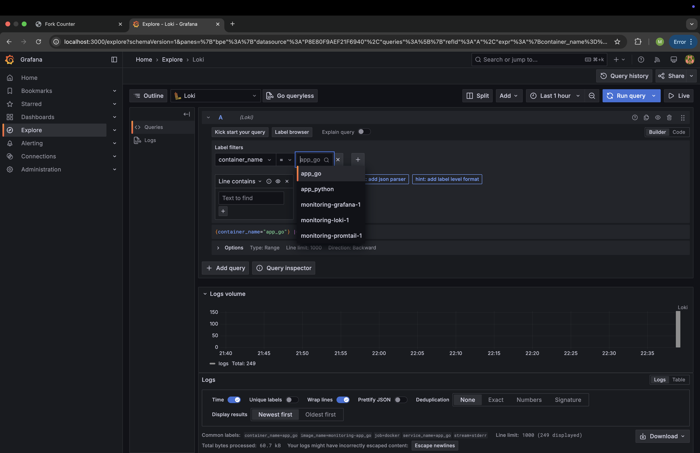

# LOGGING.md: Logging Stack Setup

## 1. Overview of the Logging Stack

The logging stack consists of the following key components:

- **Loki**: A horizontally scalable, highly available, multi-tenant log aggregation system designed to store logs in a cost-effective manner.
- **Promtail**: An agent that collects logs and ships them to Loki. It tails logs from various sources (e.g., containers, local files) and tags them with relevant metadata.
- **Grafana**: A tool used for visualizing and querying data. In this stack, it is used to visualize logs stored in Loki.
- **Python Application**: A simple Python application running in a Docker container, configured to generate logs that will be sent to Loki via Promtail.

## 2. Detailed Explanation of Each Component

### 2.1 Loki

- **Role**: Loki is the log storage system that collects, indexes, and stores logs. It is designed to work well with time-series data and is a lightweight alternative to traditional log aggregation systems like Elasticsearch.
- **Configuration**: Loki is configured in the `docker-compose.yml` file with the following parameters:
    - **Image**: `grafana/loki:latest` — The latest stable version of the Loki container image.
    - **Ports**: `3100:3100` — Loki listens on port 3100, which is exposed for querying logs.
    - **Command**: `-config.file=/etc/loki/local-config.yaml` — This specifies the configuration file for Loki (which you need to provide).

### 2.2 Promtail

- **Role**: Promtail collects logs from various sources (in this case, Docker container logs) and forwards them to Loki. It acts as the agent that bridges the logging data from the source (Python app or other containers) to the storage system (Loki).
- **Configuration**:
    - **Image**: `grafana/promtail:latest` — The latest version of the Promtail container image.
    - **Volumes**:
        - `/var/lib/docker/containers:/var/lib/docker/containers` — Mounts Docker’s container log directory, allowing Promtail to access logs from all running containers.
        - `./promtail-config.yaml:/etc/promtail/config.yaml` — The Promtail configuration file is mounted to specify how to scrape logs and how to connect to Loki.
    - **Command**: `-config.file=/etc/promtail/config.yaml` — This sets the configuration file used by Promtail to scrape logs and forward them to Loki.

### 2.3 Grafana

- **Role**: Grafana is used to visualize logs stored in Loki. It allows users to query logs and create dashboards for real-time log monitoring.
- **Configuration**:
    - **Image**: `grafana/grafana:latest` — The latest version of the Grafana container image.
    - **Ports**: `3000:3000` — Grafana listens on port 3000 for the web interface.
    - **Provisioning**: Grafana is configured to automatically set up a Loki data source on startup via the entrypoint script.

### 2.4 Python Application (app_python)

- **Role**: A simple Python-based application that generates logs, which are forwarded to Loki via Promtail.
- **Configuration**:
    - **Build Context**: The app is built using a Dockerfile located in the `../app_python` directory.
    - **Ports**: `8000:8000` — The application is accessible via port 8000.

## 3. Docker Compose Logging Configuration

The Docker Compose configuration defines a centralized logging driver for all containers:
```yaml
x-logging: &default-logging
  driver: "json-file"
  options:
    max-size: "200k"
    max-file: "10"
    tag: "{{.ImageName}}|{{.Name}}"


services:
  loki:
    image: grafana/loki:latest
    ports:
      - "3100:3100"
    command: -config.file=/etc/loki/local-config.yaml
    logging: *default-logging

  promtail:
    image: grafana/promtail:latest
    volumes:
      - /var/lib/docker/containers:/var/lib/docker/containers
      - ./promtail-config.yaml:/etc/promtail/config.yaml
    command: -config.file=/etc/promtail/config.yaml
    logging: *default-logging

  grafana:
    environment:
      - GF_PATHS_PROVISIONING=/etc/grafana/provisioning
      - GF_AUTH_ANONYMOUS_ENABLED=true
      - GF_AUTH_ANONYMOUS_ORG_ROLE=Admin
      - GF_FEATURE_TOGGLES_ENABLE=alertingSimplifiedRouting,alertingQueryAndExpressionsStepMode
    entrypoint:
      - sh
      - -euc
      - |
        mkdir -p /etc/grafana/provisioning/datasources
        cat <<EOF > /etc/grafana/provisioning/datasources/ds.yaml
        apiVersion: 1
        datasources:
        - name: Loki
          type: loki
          access: proxy 
          orgId: 1
          url: http://loki:3100
          basicAuth: false
          isDefault: true
          version: 1
          editable: false
        EOF
        /run.sh
    image: grafana/grafana:latest
    ports:
      - "3000:3000"
    logging: *default-logging
    volumes:
      - ./grafana-data:/var/lib/grafana

  app_python:
    build:
      context: ../app_python
      dockerfile: Dockerfile
    container_name: app_python
    ports:
      - "8000:8000"
    logging: *default-logging
```

Key Points:
- **Logging Driver**: All services use the `json-file` logging driver to format logs in JSON, allowing easy collection and rotation of logs.
- **Log Rotation**: Log size is limited to `200k`, and a maximum of 10 rotated log files are kept to avoid excessive disk usage.
- **Loki & Promtail Integration**: Promtail scrapes logs from containers, sends them to Loki, and Grafana visualizes them.

## 4. Screenshots of Successful Logging Stack Operation

Below are screenshots that demonstrate the successful operation of the logging stack:

1. **Loki Log Query**:
   

## Bonus

1. **All containers share logs**
   