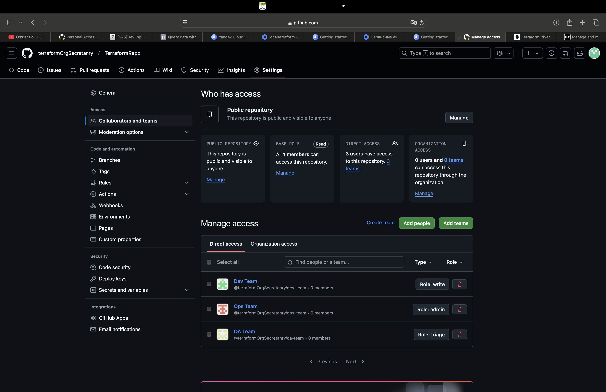

# Terraform Infrastructure Documentation

## Docker Infrastructure Using Terraform

### 1. Installing Terraform

I downloaded and installed Terraform from the [official site](https://www.terraform.io/downloads.html). Verification was performed with:

```bash
  terraform -v
```
And obtained output 
```text
  Terraform v1.10.5
  on darwin_arm64
```

### 2. Building the infrastructure
   1) I created the file **main.tf** with content:
      ```terraform
       terraform {
            required_providers {
            docker = {
                source  = "kreuzwerker/docker"
                version = "~> 3.0.1"
                }
            }
        }

        provider "docker" {}

        resource "docker_image" "nginx" {
            name         = "nginx:latest"
            keep_locally = false
        }

        resource "docker_container" "nginx" {
            image = docker_image.nginx.image_id
            name  = "MyNginx"
            ports {
                internal = 80
                external = 8000
            }
        }
      ```
   2) Then I applied these commands:
      ```bash
        terraform init
        terraform fmt
        terraform validate
        terraform apply
      ```
   3) And I saw than new nginx container appeared in my local docker daemon
   4) I applied commands and obtained corresponding outputs:
      ```bash
        terraform show
      ```
      
      ```
        # docker_container.nginx:
        resource "docker_container" "nginx" {
            attach                                      = false
            bridge                                      = null
            command                                     = [
            "nginx",
            "-g",
            "daemon off;",
            ]
            container_read_refresh_timeout_milliseconds = 15000
            cpu_set                                     = null
            cpu_shares                                  = 0
            domainname                                  = null
            entrypoint                                  = [
            "/docker-entrypoint.sh",
            ]
            env                                         = []
            hostname                                    = "2f8256b22969"
            id                                          = "2f8256b229699f0a03712d52df0e7aea7339812cee14466b286e24d3c96b641a"
            image                                       = "sha256:0dff3f9967e3cb3482965cc57c30e171f1def88e574757def5474cd791f50a16"
            init                                        = false
            ipc_mode                                    = "private"
            log_driver                                  = "json-file"
            log_opts                                    = {
            "max-file" = "5"
            "max-size" = "20m"
            }
            logs                                        = false
            max_retry_count                             = 0
            memory                                      = 0
            memory_swap                                 = 0
            must_run                                    = true
            name                                        = "MyNginx"
            network_data                                = [
            {
            gateway                   = "192.168.215.1"
            global_ipv6_address       = null
            global_ipv6_prefix_length = 0
            ip_address                = "192.168.215.2"
            ip_prefix_length          = 24
            ipv6_gateway              = null
            mac_address               = "02:42:c0:a8:d7:02"
            network_name              = "bridge"
            },
            ]
            network_mode                                = "bridge"
            pid_mode                                    = null
            privileged                                  = false
            publish_all_ports                           = false
            read_only                                   = false
            remove_volumes                              = true
            restart                                     = "no"
            rm                                          = false
            runtime                                     = "runc"
            security_opts                               = []
            shm_size                                    = 6004
            start                                       = true
            stdin_open                                  = false
            stop_signal                                 = "SIGQUIT"
            stop_timeout                                = 0
            tty                                         = false
            user                                        = null
            userns_mode                                 = null
            wait                                        = false
            wait_timeout                                = 60
            working_dir                                 = null
        
            ports {
                external = 8000
                internal = 80
                ip       = "0.0.0.0"
                protocol = "tcp"
            }
        }
        
        # docker_image.nginx:
        resource "docker_image" "nginx" {
            id           = "sha256:0dff3f9967e3cb3482965cc57c30e171f1def88e574757def5474cd791f50a16nginx:latest"
            image_id     = "sha256:0dff3f9967e3cb3482965cc57c30e171f1def88e574757def5474cd791f50a16"
            keep_locally = false
            name         = "nginx:latest"
            repo_digest  = "nginx@sha256:bc2f6a7c8ddbccf55bdb19659ce3b0a92ca6559e86d42677a5a02ef6bda2fcef"
        }
      ```
         
      ```bash
        terraform state list
      ```
      ```
        docker_container.nginx
        docker_image.nginx
      ```
   5) Then I performed variables utilization
      
      I created file **variables.tf** with such content:
      ```terraform
        variable "container_name" {
            default = "default_nginx"
            description = "Container name for nginx"
        }
      ```
      And updated file **main.tf**:
      ```terraform
        terraform {
            required_providers {
                docker = {
                  source  = "kreuzwerker/docker"
                  version = "~> 3.0.1"
                }
            }
        }
        
        provider "docker" {}
        
        resource "docker_image" "nginx" {
          name         = "nginx:latest"
          keep_locally = false
        }
        
        resource "docker_container" "nginx" {
          image = docker_image.nginx.image_id
          name  = var.container_name
          ports {
            internal = 80
            external = 8000
          }
        }
      ```
      
      Then I applied new configuration with variable value
      ```bash
        terraform apply -var="container_name=named_nginx"
      ```
      And finally I saw that I have a container with name: **named_nginx**
  6) Finally, outputs
     I created a file **outputs.tf** with content:
     ```terraform
        output "container_id" {
            description = "ID of the Docker container"
            value       = docker_container.nginx.id
        }

        output "image_id" {
            description = "ID of the Docker image"
            value       = docker_image.nginx.id
       }
     ```
     Then I applied the configuration and executed command
     ```bash
       terraform output
     ```
     ```
       container_id = "b16734743c99266ca87ab82ec2ca766e27bac0648ea936d772b78d1d4e93ea81"
       image_id = "sha256:0dff3f9967e3cb3482965cc57c30e171f1def88e574757def5474cd791f50a16nginx:latest"
     ```

## Integration with YandexCloud

1) I created a folder **yandex** inside **terraform** directory to locate terraform configuration for YandexCloud
2) I created a service account using Management Console
3) Then I gained an admin permission to my **default** directory in YC
4) I installed **yc**- YandexCloud CLI
5) Used command
   ```bash
     yc iam key create \
    --service-account-id <service_account_ID> \
    --folder-name <service_account_folder_name> \
    --output key.json
   ```
   to generate key for yandex infrastructure
6) Then I created new profile for my service account and configured it
   ```bash
     yc config profile create <profile_name>
     yc config set service-account-key key.json
     yc config set cloud-id <cloud_ID>
     yc config set folder-id <folder_ID>
     export YC_TOKEN=$(yc iam create-token)
     export YC_CLOUD_ID=$(yc config get cloud-id)
     export YC_FOLDER_ID=$(yc config get folder-id)
   ```
7) Now lets start with terraform initialization itself
   ```bash
     nano ~/.terraformrc
   ```
   and put this content:
   ```terraform
    provider_installation {
        network_mirror {
            url = "https://terraform-mirror.yandexcloud.net/"
            include = ["registry.terraform.io/*/*"]
        }
        direct {
            exclude = ["registry.terraform.io/*/*"]
        }
    }
   ```
   to use YC terraform registry
8) I created **main.tf** with such content
   ```terraform
     terraform {
         required_providers {
             yandex = {
                 source = "yandex-cloud/yandex"
             }
         }
         required_version = ">= 0.13"
     }

     provider "yandex" {
         service_account_key_file = "/Users/mishagladyshev/creds/key.json"
         zone = "ru-central1-b"
     }

     resource "yandex_compute_disk" "boot-disk-1" {
         name     = "boot-disk-1"
         type     = "network-hdd"
         zone     = "ru-central1-b"
         size     = "20"
         image_id = "fd865uon0af912uhk9cs"
         folder_id = "b1gohn091s8bh3s7jog5"
     }

     resource "yandex_compute_disk" "boot-disk-2" {
         name     = "boot-disk-2"
         type     = "network-hdd"
         zone     = "ru-central1-b"
         size     = "20"
         image_id = "fd865uon0af912uhk9cs"
         folder_id = "b1gohn091s8bh3s7jog5"
     }

     resource "yandex_compute_instance" "vm-1" {
         name = "terraform1"
         folder_id = "b1gohn091s8bh3s7jog5"

         resources {
             cores  = 2
             memory = 2
         }

         boot_disk {
             disk_id = yandex_compute_disk.boot-disk-1.id
         }

         network_interface {
             subnet_id = yandex_vpc_subnet.subnet-1.id
             nat       = true
         }

         metadata = {
             user-data = file("./meta.txt")
         }
     }

     resource "yandex_compute_instance" "vm-2" {
         name = "terraform2"
         folder_id = "b1gohn091s8bh3s7jog5"

         resources {
             cores  = 4
             memory = 4
         }

         boot_disk {
             disk_id = yandex_compute_disk.boot-disk-2.id
         }

         network_interface {
             subnet_id = yandex_vpc_subnet.subnet-1.id
             nat       = true
         }

         metadata = {
             user-data = file("./meta.txt")
         }
     }

     resource "yandex_vpc_network" "network-1" {
         name = "network1"
         folder_id = "b1gohn091s8bh3s7jog5"
     }

     resource "yandex_vpc_subnet" "subnet-1" {
         name           = "subnet1"
         zone           = "ru-central1-b"
         network_id     = yandex_vpc_network.network-1.id
         v4_cidr_blocks = ["192.168.10.0/24"]
         folder_id = "b1gohn091s8bh3s7jog5"
     }
   ```
9) I created a file **meta.txt** to allow ssh connection from my machine to created vm
   ```
     #cloud-config
     users:
       - name: misha
       groups: sudo
       shell: /bin/bash
       sudo: 'ALL=(ALL) NOPASSWD:ALL'
       ssh_authorized_keys:
         - <my_public_key>
   ```
10) ```bash
      terraform init
      terraform providers lock -net-mirror=https://terraform-mirror.yandexcloud.net -platform=darwin_arm64 -platform=linux_amd64 yandex-cloud/yandex
    ```
    to initialize terraform able to with both with **linux** and **macOS**
11) Created file **outputs.tf** to have an output with ip-addresses of created machines
    ```terraform
      output "internal_ip_address_vm_1" {
        value = yandex_compute_instance.vm-1.network_interface.0.ip_address
      }

      output "internal_ip_address_vm_2" {
        value = yandex_compute_instance.vm-2.network_interface.0.ip_address
      }

      output "external_ip_address_vm_1" {
        value = yandex_compute_instance.vm-1.network_interface.0.nat_ip_address
      }

      output "external_ip_address_vm_2" {
        value = yandex_compute_instance.vm-2.network_interface.0.nat_ip_address
      }
    ```
12) Formatting and validation
    ```bash
      terraform validate
      terraform fmt
    ```
13) Check plan
    ```bash
      terraform plan
    ```
    Validated that deploy plan is valid
14) Deploy infrastructure
    ```bash
      terraform apply
    ```
    ```
      yandex_vpc_subnet.subnet-1: Destroying... [id=fl8ac3l8r8s27fa3j196]
      yandex_compute_disk.boot-disk-1: Destroying... [id=fv4bat6f5sioajqsd5kg]
      yandex_compute_disk.boot-disk-2: Destroying... [id=fv4fjveuqccn4gh8cdh0]
      yandex_vpc_subnet.subnet-1: Destruction complete after 2s
      yandex_vpc_subnet.subnet-1: Creating...
      yandex_vpc_subnet.subnet-1: Creation complete after 1s [id=e2likgav87rqbbrn8gni]
      yandex_compute_disk.boot-disk-2: Still destroying... [id=fv4fjveuqccn4gh8cdh0, 10s elapsed]
      yandex_compute_disk.boot-disk-1: Still destroying... [id=fv4bat6f5sioajqsd5kg, 10s elapsed]
      yandex_compute_disk.boot-disk-1: Destruction complete after 10s
      yandex_compute_disk.boot-disk-1: Creating...
      yandex_compute_disk.boot-disk-2: Destruction complete after 13s
      yandex_compute_disk.boot-disk-2: Creating...
      yandex_compute_disk.boot-disk-1: Creation complete after 8s [id=epd3v4onprj4brgk6rom]
      yandex_compute_instance.vm-1: Creating...
      yandex_compute_disk.boot-disk-2: Still creating... [10s elapsed]
      yandex_compute_disk.boot-disk-2: Creation complete after 11s [id=epdd3lljcr29cuc9jvva]
      yandex_compute_instance.vm-2: Creating...
      yandex_compute_instance.vm-1: Still creating... [10s elapsed]
      yandex_compute_instance.vm-2: Still creating... [10s elapsed]
      yandex_compute_instance.vm-1: Still creating... [20s elapsed]
      yandex_compute_instance.vm-2: Still creating... [20s elapsed]
      yandex_compute_instance.vm-1: Still creating... [30s elapsed]
      yandex_compute_instance.vm-2: Creation complete after 30s [id=epdlaf5lmugb96istces]
      yandex_compute_instance.vm-1: Still creating... [40s elapsed]
      yandex_compute_instance.vm-1: Creation complete after 45s [id=epdrmnodflp33m5p8ii7]

      Apply complete! Resources: 5 added, 0 changed, 3 destroyed.

      Outputs:

      external_ip_address_vm_1 = "51.250.96.104"
      external_ip_address_vm_2 = "84.201.142.48"
      internal_ip_address_vm_1 = "192.168.10.21"
      internal_ip_address_vm_2 = "192.168.10.4"
    ```
    
## GitHub integration
1) I created a repo **test_Private** in my GH account with private visibility and README
2) I generated PAT for my account using GitHub WEB interface
3) I created **github** folder inside **terraform** directory to store files for integration
4) I created **main.tf** with such content:
   ```terraform
     terraform {
       required_providers {
         github = {
           source  = "integrations/github"
           version = "~> 4.0"
         }
       }
     }

     provider "github" {
       token = var.token # or `GITHUB_TOKEN`
     }

     #Create and initialise a public GitHub Repository with MIT license and a Visual Studio .gitignore file (incl. issues and wiki)
     resource "github_repository" "repo" {
       name               = "TerraformRepo"
       description        = "My awesome automated codebase"
       visibility         = "public"
       has_issues         = true
       has_wiki           = true
       auto_init          = true
       license_template   = "mit"
       gitignore_template = "VisualStudio"
     }

     #Set default branch 'main'
     resource "github_branch_default" "main" {
       repository = github_repository.repo.name
       branch     = "main"
     }

     resource "github_branch_protection" "default" {
       repository_id                   = github_repository.repo.id
       pattern                         = github_branch_default.main.branch
       require_conversation_resolution = true
       enforce_admins                  = true

       required_pull_request_reviews {
         required_approving_review_count = 1
       }
     }
   ```
   It is config for resulting repo
5) I created file **variables.tf** to work with token variable
   ```terraform
     variable "token" {
       type        = string 
       description = "Specifies the GitHub PAT token or `GITHUB_TOKEN`"
       sensitive   = true
     }
   ```
6) Init terraform
   ```bash
     terraform init
   ```
7) I put my token to environment variable using such commands
   ```bash
     export GITHUB_TOKEN=<my_token>
     export TF_VAR_token=$GITHUB_TOKEN
   ```
8) Validate and format terraform config
   ```bash
     terraform validate
     terraform fmt
   ```
9) Import **existing** repo to terraform config
   ```bash
     terraform import "github_repository.repo" "test_Private"
   ```
   ```
     github_repository.repo: Importing from ID "test_Private"...
     github_repository.repo: Import prepared!
     Prepared github_repository for import
     github_repository.repo: Refreshing state... [id=test_Private]

     Import successful!

     The resources that were imported are shown above. These resources are now in
     your Terraform state and will henceforth be managed by Terraform.
   ```
10) Apply terraform config to repo
    ```bash
      terraform apply
    ```
    ```
      github_repository.repo: Refreshing state... [id=test_Private]

      Terraform used the selected providers to generate the following execution plan. Resource actions are indicated with the following symbols:
      + create
      ~ update in-place

      Terraform will perform the following actions:

      # github_branch_default.main will be created
      + resource "github_branch_default" "main" {
        + branch     = "main"
        + id         = (known after apply)
        + repository = "TerraformRepo"
      }

      # github_branch_protection.default will be created
      + resource "github_branch_protection" "default" {
        + allows_deletions                = false
        + allows_force_pushes             = false
        + blocks_creations                = false
        + enforce_admins                  = true
        + id                              = (known after apply)
        + pattern                         = "main"
        + repository_id                   = "test_Private"
        + require_conversation_resolution = true
        + require_signed_commits          = false
        + required_linear_history         = false

        + required_pull_request_reviews {
          + required_approving_review_count = 1
        }
      }

      # github_repository.repo will be updated in-place
      ~ resource "github_repository" "repo" {
        ~ auto_init                   = false -> true
        ~ description                 = "somedesc" -> "My awesome automated codebase"
        + gitignore_template          = "VisualStudio"
        - has_downloads               = true -> null
        - has_projects                = true -> null
        ~ has_wiki                    = false -> true
        id                          = "test_Private"
        + license_template            = "mit"
        ~ name                        = "test_Private" -> "TerraformRepo"
        ~ visibility                  = "private" -> "public"
        # (27 unchanged attributes hidden)
      }

      Plan: 2 to add, 1 to change, 0 to destroy.

      Do you want to perform these actions?
      Terraform will perform the actions described above.
      Only 'yes' will be accepted to approve.

        Enter a value: yes

      github_repository.repo: Modifying... [id=test_Private]
      github_repository.repo: Modifications complete after 6s [id=TerraformRepo]
      github_branch_default.main: Creating...
      github_branch_default.main: Creation complete after 1s [id=TerraformRepo]
      ╷
      │ Error: Provider produced inconsistent final plan
      │
      │ When expanding the plan for github_branch_protection.default to include new values learned so far during apply, provider "registry.terraform.io/integrations/github" produced an invalid new value for
      │ .repository_id: was cty.StringVal("test_Private"), but now cty.StringVal("TerraformRepo").
      │
      │ This is a bug in the provider, which should be reported in the provider's own issue tracker.
      ╵
    ```
    As we see there is a bug in github provider about applying some properties change in a row with changing repo name,
    but we can apply second time
    ```bash
      terraform apply
    ```
    ```
      github_repository.repo: Refreshing state... [id=TerraformRepo]
      github_branch_default.main: Refreshing state... [id=TerraformRepo]

      Terraform used the selected providers to generate the following execution plan. Resource actions are indicated with the following symbols:
      + create
      ~ update in-place

      Terraform will perform the following actions:

      # github_branch_protection.default will be created
      + resource "github_branch_protection" "default" {
        + allows_deletions                = false
        + allows_force_pushes             = false
        + blocks_creations                = false
        + enforce_admins                  = true
        + id                              = (known after apply)
        + pattern                         = "main"
        + repository_id                   = "TerraformRepo"
        + require_conversation_resolution = true
        + require_signed_commits          = false
        + required_linear_history         = false

        + required_pull_request_reviews {
          + required_approving_review_count = 1
        }
      }

      # github_repository.repo will be updated in-place
      ~ resource "github_repository" "repo" {
        id                          = "TerraformRepo"
        name                        = "TerraformRepo"
        - vulnerability_alerts        = true -> null
        # (34 unchanged attributes hidden)
      }

      Plan: 1 to add, 1 to change, 0 to destroy.

      Do you want to perform these actions?
      Terraform will perform the actions described above.
      Only 'yes' will be accepted to approve.

        Enter a value: yes

      github_repository.repo: Modifying... [id=TerraformRepo]
      github_repository.repo: Modifications complete after 2s [id=TerraformRepo]
      github_branch_protection.default: Creating...
      github_branch_protection.default: Creation complete after 5s [id=BPR_kwDON1B6js4DigMC]

      Apply complete! Resources: 1 added, 1 changed, 0 destroyed.
    ```
    Now applying is successful! We can check the repo
    
    As we see, README stayed from old repo, because we didnt change it in terraform, but name, visibility and etc. are changed.

## Best practices
#### Separation of Concerns:
Organize your Terraform configuration files into a dedicated directory.
#### Sensitive Data Management:
Never hard-code secrets (e.g., tokens) in your configuration files. Use environment variables or secret management tools.
#### Versioning:
Pin provider versions to ensure consistent deployments (e.g., version = "~> 5.0").
#### Documentation:
Keep your infrastructure as code well-documented for easier maintenance and onboarding.

## Organization adding(Bonus!)
1) I created organization **terraformOrgSecretanry**
2) I created a repo **TerraformRepo** in it
3) Extending terraform config to create teams and gain specific access
   ```terraform
    terraform {
      required_providers {
        github = {
          source  = "integrations/github"
          version = "~> 4.0"
        }
      }
    }

    provider "github" {
      token = var.token # or `GITHUB_TOKEN`
      owner = "terraformOrgSecretanry"
    }

    #Create and initialise a public GitHub Repository with MIT license and a Visual Studio .gitignore file (incl. issues and wiki)
    resource "github_repository" "repo" {
      name               = "TerraformRepo"
      description        = "My awesome automated codebase"
      visibility         = "public"
      has_issues         = true
      has_wiki           = true
      auto_init          = true
      license_template   = "mit"
      gitignore_template = "VisualStudio"
    }

    #Set default branch 'main'
    resource "github_branch_default" "main" {
      repository = github_repository.repo.name
      branch     = "main"
    }

    resource "github_branch_protection" "default" {
      repository_id                   = github_repository.repo.id
      pattern                         = github_branch_default.main.branch
      require_conversation_resolution = true
      enforce_admins                  = true

      required_pull_request_reviews {
        required_approving_review_count = 1
      }
    }

    resource "github_team" "dev_team" {
      name        = "Dev Team"
      description = "Team responsible for development work."
      privacy     = "closed"
    }

    resource "github_team" "qa_team" {
      name        = "QA Team"
      description = "Team responsible for quality assurance."
      privacy     = "closed"
    }

    resource "github_team" "ops_team" {
      name        = "Ops Team"
      description = "Team responsible for operations and administrative access."
      privacy     = "closed"
    }

    resource "github_team_repository" "dev_team_repo_access" {
      team_id    = github_team.dev_team.id
      repository = github_repository.repo.name
      permission = "push"
    }

    resource "github_team_repository" "qa_team_repo_access" {
      team_id    = github_team.qa_team.id
      repository = github_repository.repo.name
      permission = "triage"
    }

    resource "github_team_repository" "ops_team_repo_access" {
      team_id    = github_team.ops_team.id
      repository = github_repository.repo.name
      permission = "admin"
    }
   ```
4) Applying changes
   ```bash
     terraform apply
   ```
   ```
     github_repository.repo: Refreshing state... [id=TerraformRepo]
     github_branch_default.main: Refreshing state... [id=TerraformRepo]
     github_branch_protection.default: Refreshing state... [id=BPR_kwDON1B6js4DigMC]

     Terraform used the selected providers to generate the following execution plan. Resource actions are indicated with the following symbols:
     + create
     ~ update in-place

     Terraform will perform the following actions:

     # github_repository.repo will be updated in-place
     ~ resource "github_repository" "repo" {
       + description                 = "My awesome automated codebase"
       - has_downloads               = true -> null
       - has_projects                = true -> null
       id                          = "TerraformRepo"
       name                        = "TerraformRepo"
       - vulnerability_alerts        = true -> null
       # (31 unchanged attributes hidden)
     }

     # github_team.dev_team will be created
     + resource "github_team" "dev_team" {
       + create_default_maintainer = false
       + description               = "Team responsible for development work."
       + etag                      = (known after apply)
       + id                        = (known after apply)
       + members_count             = (known after apply)
       + name                      = "Dev Team"
       + node_id                   = (known after apply)
       + privacy                   = "closed"
       + slug                      = (known after apply)
     }

     # github_team.ops_team will be created
     + resource "github_team" "ops_team" {
       + create_default_maintainer = false
       + description               = "Team responsible for operations and administrative access."
       + etag                      = (known after apply)
       + id                        = (known after apply)
       + members_count             = (known after apply)
       + name                      = "Ops Team"
       + node_id                   = (known after apply)
       + privacy                   = "closed"
       + slug                      = (known after apply)
     }

     # github_team.qa_team will be created
     + resource "github_team" "qa_team" {
       + create_default_maintainer = false
       + description               = "Team responsible for quality assurance."
       + etag                      = (known after apply)
       + id                        = (known after apply)
       + members_count             = (known after apply)
       + name                      = "QA Team"
       + node_id                   = (known after apply)
       + privacy                   = "closed"
       + slug                      = (known after apply)
     }

     # github_team_repository.dev_team_repo_access will be created
     + resource "github_team_repository" "dev_team_repo_access" {
       + etag       = (known after apply)
       + id         = (known after apply)
       + permission = "push"
       + repository = "TerraformRepo"
       + team_id    = (known after apply)
     }

     # github_team_repository.ops_team_repo_access will be created
     + resource "github_team_repository" "ops_team_repo_access" {
       + etag       = (known after apply)
       + id         = (known after apply)
       + permission = "admin"
       + repository = "TerraformRepo"
       + team_id    = (known after apply)
     }

     # github_team_repository.qa_team_repo_access will be created
     + resource "github_team_repository" "qa_team_repo_access" {
       + etag       = (known after apply)
       + id         = (known after apply)
       + permission = "triage"
       + repository = "TerraformRepo"
       + team_id    = (known after apply)
     }

     Plan: 6 to add, 1 to change, 0 to destroy.

     Do you want to perform these actions?
     Terraform will perform the actions described above.
     Only 'yes' will be accepted to approve.

       Enter a value: yes

     github_team.dev_team: Creating...
     github_team.qa_team: Creating...
     github_team.ops_team: Creating...
     github_repository.repo: Modifying... [id=TerraformRepo]
     github_team.dev_team: Still creating... [10s elapsed]
     github_team.ops_team: Still creating... [10s elapsed]
     github_repository.repo: Still modifying... [id=TerraformRepo, 10s elapsed]
     github_team.qa_team: Still creating... [10s elapsed]
     github_team.dev_team: Creation complete after 16s [id=12124682]
     github_team.ops_team: Creation complete after 16s [id=12124683]
     github_team.qa_team: Creation complete after 16s [id=12124684]
     github_repository.repo: Modifications complete after 17s [id=TerraformRepo]
     github_team_repository.qa_team_repo_access: Creating...
     github_team_repository.dev_team_repo_access: Creating...
     github_team_repository.ops_team_repo_access: Creating...
     github_team_repository.qa_team_repo_access: Creation complete after 5s [id=12124684:TerraformRepo]
     github_team_repository.ops_team_repo_access: Creation complete after 5s [id=12124683:TerraformRepo]
     github_team_repository.dev_team_repo_access: Creation complete after 6s [id=12124682:TerraformRepo]

     Apply complete! Resources: 6 added, 1 changed, 0 destroyed.
   ```
   Repository changes:
   
   We are done!